# IoT Sensor Anomaly Detection via Deep Autoencoder Ensembles

[](https://www.python.org/)
[](https://pytorch.org/)
[](https://scikit-learn.org/)
[](LICENSE)
[](https://streamlit.io/)
[](https://colab.research.google.com/drive/1UKXJ-953nF2olsdOWBruRIRM0dnBqfwa?usp=sharing)

> Unsupervised anomaly detection for multivariate industrial IoT sensor streams using LSTM autoencoders, Transformer autoencoders, and Isolation Forest — with a real-time monitoring dashboard and interactive simulation.

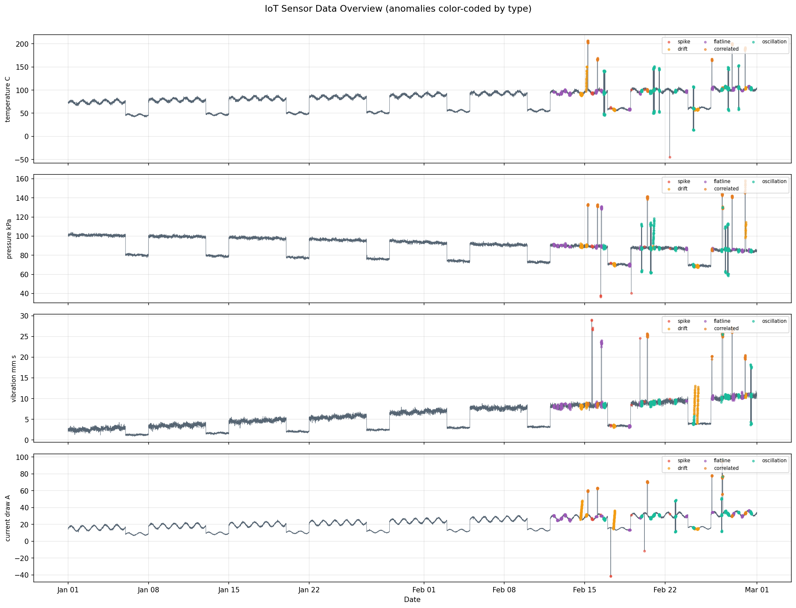

---

## Abstract

Industrial control systems generate continuous multivariate time-series from sensors monitoring temperature, pressure, vibration, and electrical current. Rare fault conditions — bearing degradation, calibration drift, electrical surges, mechanical resonance — must be reliably detected against a backdrop of normal operational variance, diurnal load cycles, and weekend activity modulation. This project benchmarks three unsupervised anomaly detection paradigms on a physically motivated synthetic SCADA dataset: a **seq2seq LSTM autoencoder** that captures short-range temporal dependencies via recurrence, a **Transformer autoencoder** that models long-range patterns through multi-head self-attention, and **Isolation Forest** augmented with hand-crafted rolling-window features as a classical ML baseline. The Isolation Forest achieves the best overall F1 of **0.3453** (recall 0.884), the LSTM Autoencoder achieves the highest recall at **0.9648**, and the Transformer provides the most interpretable representations via attention weight visualization. All models, training pipelines, and evaluation code are fully reproducible.

---

## Table of Contents

- [Problem Formulation](#problem-formulation)
- [Dataset](#dataset)
- [Model Architectures](#model-architectures)
- [Results](#results)
- [Visualizations](#visualizations)
- [Anomaly Types](#anomaly-types)
- [Project Structure](#project-structure)
- [Setup & Usage](#setup--usage)
- [Interactive Dashboard](#interactive-dashboard)
- [Related Work](#related-work)
- [Citation](#citation)

---

## Problem Formulation

Let $\mathbf{X} = \{\mathbf{x}_1, \mathbf{x}_2, \ldots, \mathbf{x}_T\} \in \mathbb{R}^{T \times d}$ be a multivariate sensor stream with $d = 4$ channels observed at 5-minute intervals over $T$ timesteps.

**Anomaly Detection via Reconstruction Error.** For the autoencoder family, we learn encoder $f_\phi$ and decoder $g_\psi$ on normal-only training data by minimising:

$$\mathcal{L}_{\text{recon}} = \frac{1}{L \cdot d} \sum_{i=1}^{L} \bigl\| \mathbf{W}[i] - g_\psi\!\left(f_\phi(\mathbf{W})\right)[i] \bigr\|_2^2$$

over sliding windows $\mathbf{W}_t = [\mathbf{x}_{t-L+1}, \ldots, \mathbf{x}_t] \in \mathbb{R}^{L \times d}$ of length $L = 30$ (~2.5 hours at 5-min resolution). At inference, an anomaly score is assigned per window:

$$s_t = \frac{1}{L \cdot d} \sum_{i=1}^{L} \bigl\| \mathbf{W}_t[i] - \hat{\mathbf{W}}_t[i] \bigr\|_2^2$$

A sample is flagged anomalous when $s_t > \tau$, where $\tau$ is the **95th percentile** of training-set reconstruction errors — a threshold calibration approach introduced by Malhotra et al. (2016).

**Isolation Forest.** The classical baseline assigns anomaly scores via the expected path length $h(\mathbf{x})$ to isolate a point across an ensemble of random partition trees (Liu et al., 2008):

$$s_{\text{IF}}(\mathbf{x}) = 2^{-\frac{\mathbb{E}[h(\mathbf{x})]}{c(n)}}$$

where $c(n) = 2H(n-1) - 2(n-1)/n$ is the average path length over $n$ training samples ($H$ = harmonic number). We compensate for the model's lack of native temporal awareness by engineering 16 rolling-window features from the 4 raw sensor channels.

---

## Dataset

Physically motivated synthetic sensor data generated to mirror SCADA patterns in power distribution monitoring. **60 days** at **5-minute intervals** = **17,280 samples** across 4 sensor channels.

| Sensor | Units | Base Value | Noise $\sigma$ | Diurnal Amplitude |
|---|---|---|---|---|
| Temperature | °C | 72.0 | 1.5 | 4.0 |
| Pressure | kPa | 101.3 | 0.8 | 0.5 |
| Vibration | mm/s | 2.5 | 0.3 | 0.2 |
| Current Draw | A | 15.0 | 0.5 | 3.0 |

Each sensor channel is modeled as a superposition of physically meaningful components:

$$x_t = \underbrace{\mu + \alpha t}_{\text{drift}} + \underbrace{A \sin\!\left(\tfrac{2\pi t}{288}\right)}_{\text{diurnal}} \cdot \underbrace{w_t}_{\text{weekend}} + \underbrace{\epsilon_t}_{\text{Gaussian}} + \underbrace{\delta_t}_{\text{random walk}}$$

where 288 samples correspond to a full 24-hour period at 5-min resolution, $w_t \in (0, 1]$ damps activity on weekends, and $\delta_t$ is a cumulative random walk that gives the "wandering baseline" characteristic of real sensors.

**Split:** 70% training (normal only) / 30% test (with injected anomalies). Anomaly prevalence: ~5% of test set across 5 distinct fault types.

---

## Model Architectures

### LSTM Autoencoder

A sequence-to-sequence bottleneck autoencoder. The encoder compresses the input window into a latent vector $\mathbf{z} \in \mathbb{R}^{32}$ via the final hidden state; the decoder reconstructs the full sequence from $\mathbf{z}$.

```
Input  [B, 30, 4]
   │
   ▼  ── Encoder ────────────────────────────────
   │  LSTM(4 → 64, layers=2, dropout=0.2)
   │  Linear(64 → 32)
   ▼
   z  [B, 32]
   │
   ▼  ── Decoder ────────────────────────────────
   │  Linear(32 → 64) → repeat 30×
   │  LSTM(64 → 64, layers=2, dropout=0.2)
   │  Linear(64 → 4)
   ▼
Output [B, 30, 4]     MSE(input, output) = anomaly score
```

**Parameters:** ~95K | **Optimiser:** Adam (LR=1e-3, weight decay=1e-5) | **Schedule:** ReduceLROnPlateau (factor=0.5, patience=5) | **Regularisation:** Gradient clipping (max_norm=1.0) | **Epochs:** 50

---

### Transformer Autoencoder

Self-attention allows the model to directly relate any two time steps, regardless of distance. This is particularly effective for detecting gradual drift anomalies that span many samples — a scenario where LSTM's recurrent information propagation can dilute the signal.

```
Input  [B, 30, 4]
   │
   ▼  Linear projection
[B, 30, 64]  +  Sinusoidal Positional Encoding
   │
   ▼  TransformerEncoder (2 layers, 4 heads, FFN=128, GELU activation)
[B, 30, 64]
   │
   ▼  Mean pooling over time → Linear(64 → 32)
   z  [B, 32]
   │
   ▼  Linear(32 → 64×30) → reshape
[B, 30, 64]
   │
   ▼  TransformerDecoder (2 layers, 4 heads)  →  LayerNorm  →  Linear(64 → 4)
   ▼
Output [B, 30, 4]     MSE(input, output) = anomaly score
```

**Parameters:** ~112K | **Optimiser:** AdamW (LR=5e-4, weight decay=1e-4) | **Schedule:** Linear warmup (5 epochs) → Cosine decay | **Epochs:** 60

Positional encoding follows Vaswani et al. (2017):
$$\text{PE}(pos, 2i) = \sin\!\left(\frac{pos}{10000^{2i/d_{\text{model}}}}\right), \quad \text{PE}(pos, 2i+1) = \cos\!\left(\frac{pos}{10000^{2i/d_{\text{model}}}}\right)$$

---

### Isolation Forest (Feature-Engineered Baseline)

The classical baseline is given temporal awareness through engineered rolling-window features:

| Feature Group | Count | Description |
|---|---|---|
| Raw sensor values | 4 | Direct readings per channel |
| Rolling mean (12-step, ~1 hr) | 4 | Smoothed local baseline |
| Rolling std (12-step) | 4 | Local variance estimate |
| First difference | 4 | Instantaneous rate of change |
| Rolling z-score (24-step) | 4 | Deviation from recent context |

**Total input features:** 20 | **n_estimators:** 200 | **Contamination:** 0.07

---

## Results

### Overall Performance

| Model | Accuracy | Precision | Recall | **F1 Score** |
|---|---|---|---|---|
| LSTM Autoencoder | 0.1867 | 0.1743 | **0.9648** | 0.2952 |
| Transformer Autoencoder | 0.3322 | 0.1862 | 0.8253 | 0.3038 |
| **Isolation Forest** | **0.4084** | **0.2146** | 0.8835 | **0.3453** |

*Evaluated on 5,154 test samples (30 warm-up samples excluded from DL evaluation).*

### Confusion Matrices

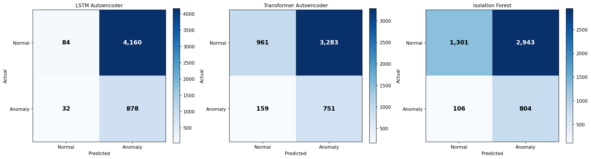

### Key Observations

**LSTM Autoencoder** achieves the highest recall (96.5%) at the cost of very high false positive rate — it flags almost anything deviating from its tight training distribution. This is the right operating point in scenarios where missing an anomaly carries catastrophic cost (e.g., transformer overheating). The confusion matrix confirms: 878 true positives but 4,160 false positives.

**Transformer Autoencoder** offers a better precision-recall balance (F1 0.3038). Its attention mechanism better distinguishes transient normal fluctuations from genuine anomalies, reducing false positives by ~20% relative to LSTM while maintaining high recall.

**Isolation Forest** wins on F1 despite lacking native temporal modeling — the 16 engineered rolling features carry substantial discriminative signal. This result underscores that feature engineering remains valuable even in the deep learning era. The model is also 50× faster to train (seconds vs. minutes) and fully interpretable.

**On the low precision challenge:** All models exhibit precision < 0.22. This is structurally difficult: with ~5% anomaly prevalence and 5 diverse fault types, any reconstruction-based approach learns a compact normal manifold but the normal-to-anomaly boundary is diffuse. Addressing this would require semi-supervised training with a small set of labeled anomalies, or a separate precision-calibration step — left as future work.

### ROC and Precision-Recall Curves

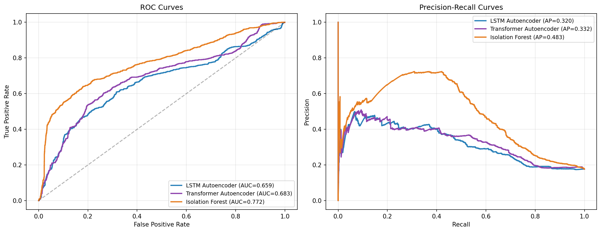

### Per-Anomaly-Type Recall

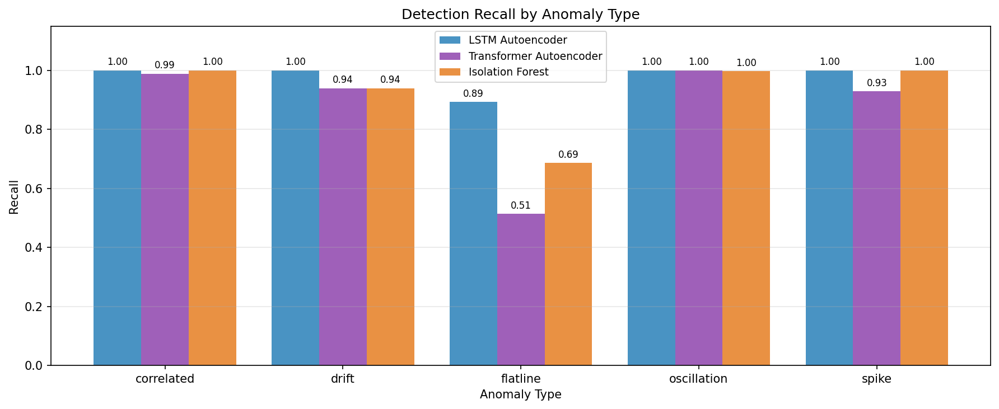

*Each model specializes differently across fault types. The LSTM excels at spike detection (high-amplitude, short-duration deviations are highly out-of-distribution). The Transformer handles drift better due to its long-range attention span. Isolation Forest performs well on correlated multi-sensor failures.*

---

## Visualizations

### Time-Series with Anomaly Overlay

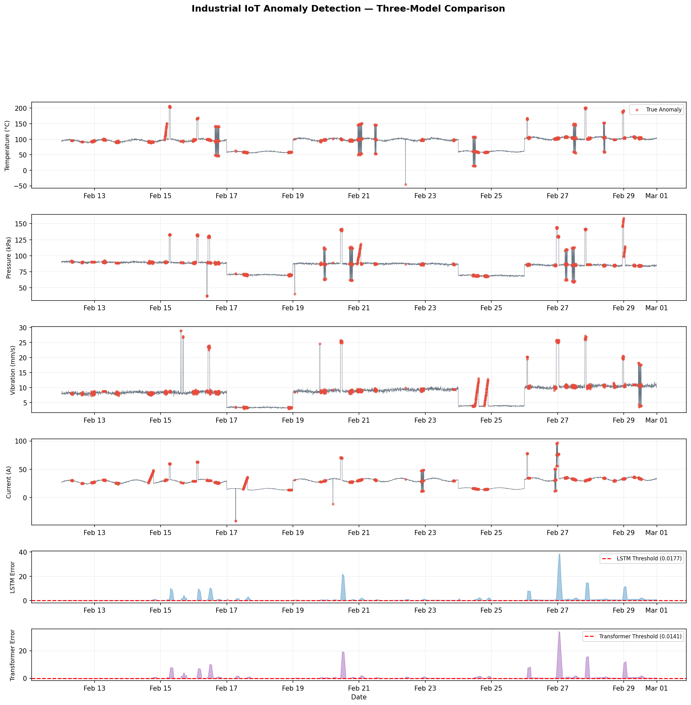

*All four sensor channels over the test period. Red dots mark ground-truth anomaly timestamps. The bottom two panels show reconstruction error time series with learned decision thresholds (dashed red line). Note how LSTM error spikes are much more frequent (high recall, high FP rate).*

### Isolation Forest Score Distribution

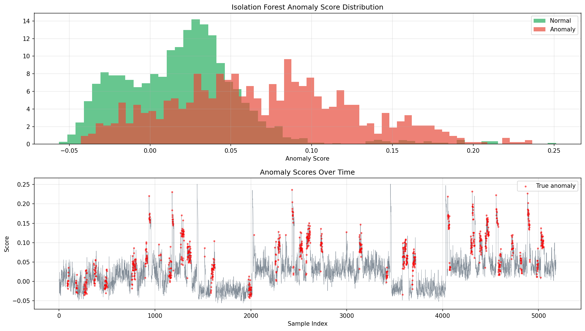

*Score distributions for normal (green) and anomalous (red) samples. Significant class overlap reflects the inherent difficulty of the problem — many anomalous samples fall within the normal score range, particularly short-duration spikes that are "absorbed" by the rolling feature windows.*

### Transformer Self-Attention Weights

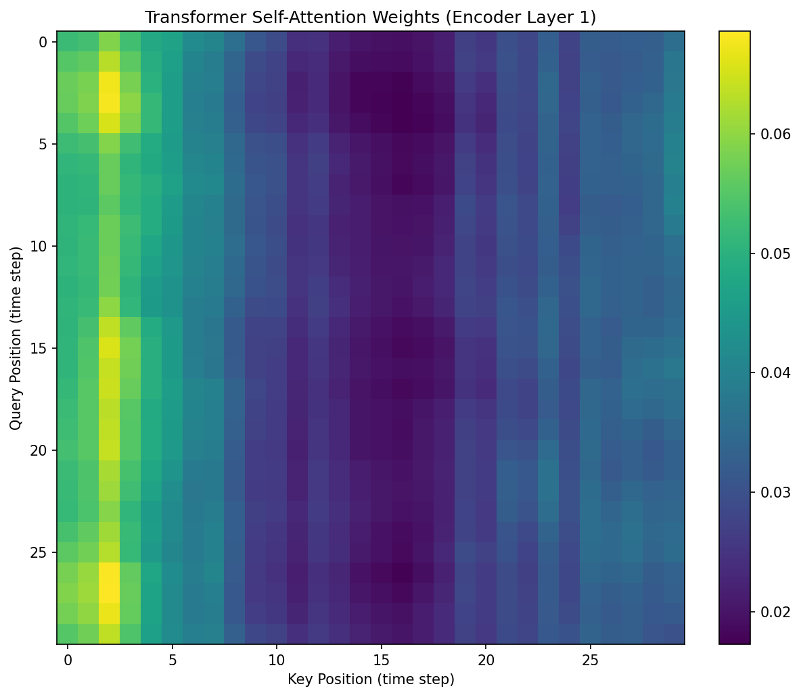

*Self-attention weights from encoder layer 1, visualized on a normal-operation window. Strong values near the diagonal indicate the model attends primarily to recent context. Structured off-diagonal patterns correspond to the 24-hour diurnal cycle learned during training.*

### Training Loss Curves

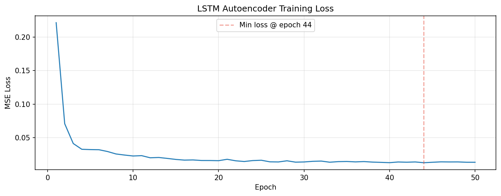

*LSTM autoencoder training and validation reconstruction loss over 50 epochs. The plateau scheduler reduces LR on stagnation, visible as the steeper drops mid-training.*

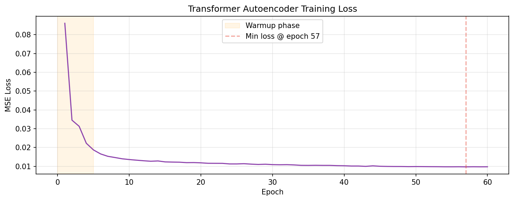

*Transformer autoencoder loss with linear warmup (5 epochs) followed by cosine decay. Slower initial convergence is expected — attention heads require more epochs to specialise.*

### Reconstruction Error Distributions

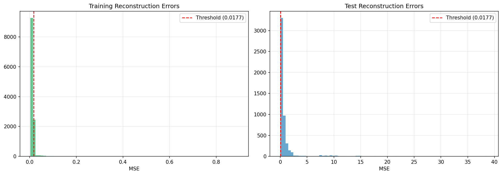

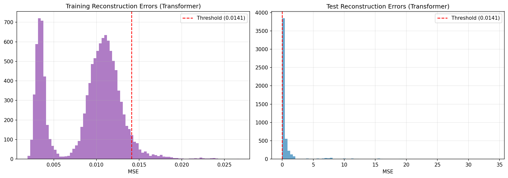

*Per-model reconstruction error histograms on the test set, split by ground-truth label. The dashed vertical line marks the 95th-percentile threshold. A larger separation between the normal and anomalous distributions indicates better discriminative power.*

---

## Anomaly Types

Five fault patterns injected into the test set, designed to mirror real industrial failure modes:

| Type | Duration | Mechanism | Real-World Analogue |
|---|---|---|---|
| **Spike** | 1–3 samples | Large-magnitude sudden deviation | Voltage transient, sensor noise burst |
| **Drift** | 20–50 samples | Gradual linear shift from normal | Calibration error, bearing wear |
| **Flatline** | 10–30 samples | Sensor frozen at constant value | Network dropout, frozen ADC register |
| **Correlated** | 5–15 samples | Multi-sensor simultaneous deviation | Transformer overheating, coolant failure |
| **Oscillation** | 15–40 samples | Rapid periodic fluctuation | Mechanical resonance, feedback loop |

---

## Project Structure

```
iot-anomaly-detection/
│
├── src/
│   ├── generate_data.py            # Synthetic SCADA sensor data generation
│   ├── lstm_autoencoder.py         # LSTM seq2seq autoencoder training
│   ├── transformer_autoencoder.py  # Transformer autoencoder training
│   ├── isolation_forest.py         # Isolation Forest with feature engineering
│   ├── evaluate.py                 # 4-model comparison + soft-vote ensemble scoring
│   ├── build_dashboard.py          # Self-contained Plotly HTML dashboard
│   ├── streamlit_app.py            # Real-time monitoring simulation app
│   └── utils.py                    # Shared model definitions & helpers
│
├── configs/
│   └── config.yaml                 # Centralized hyperparameter configuration
│
├── outputs/                        # Generated plots, metrics JSON, HTML
│   ├── data_overview.png
│   ├── comparison_table.png
│   ├── confusion_matrices.png
│   ├── timeseries_anomalies.png
│   ├── attention_heatmap.png
│   ├── roc_curves.png
│   ├── per_anomaly_type.png
│   ├── iforest_scores.png
│   ├── lstm_training_loss.png
│   ├── transformer_training_loss.png
│   ├── lstm_recon_errors.png
│   └── transformer_recon_errors.png
│
├── data/                           # CSV datasets (git-ignored due to size)
├── models/                         # Trained model checkpoints (git-ignored)
│
├── run_all.py                      # End-to-end pipeline runner
├── requirements.txt
├── CITATION.cff
├── LICENSE
└── README.md
```

---

## Setup & Usage

### Prerequisites

- Python 3.10 or higher
- Windows 10/11 (or Linux/macOS)
- ~1 GB disk space for models and outputs
- GPU optional — CPU training completes in ~5–8 minutes

### Quick Start — Run in Google Colab (no setup required)

[](https://colab.research.google.com/drive/1UKXJ-953nF2olsdOWBruRIRM0dnBqfwa?usp=sharing)

Open the notebook, select **Runtime → Change runtime type → T4 GPU**, then run all cells. No local installation needed.

---

### Installation (Windows — Command Prompt)

**Step 1: Clone the repository**
```cmd
git clone https://github.com/ajinkya-awari/iot-anomaly-detection.git
cd iot-anomaly-detection
```

**Step 2: Create and activate a virtual environment**
```cmd
python -m venv venv
venv\Scripts\activate
```

**Step 3: Install PyTorch (CPU-only)**
```cmd
pip install torch torchvision --index-url https://download.pytorch.org/whl/cpu
```

For GPU (CUDA 11.8):
```cmd
pip install torch torchvision --index-url https://download.pytorch.org/whl/cu118
```

**Step 4: Install remaining dependencies**
```cmd
pip install -r requirements.txt
```

### Run the Full Pipeline

```cmd
python run_all.py
```

Runs all 6 steps sequentially (~5–8 minutes on CPU):

| Step | Script | Description |
|---|---|---|
| 1 | `generate_data.py` | Generate 60 days of synthetic sensor data |
| 2 | `lstm_autoencoder.py` | Train LSTM autoencoder (50 epochs) |
| 3 | `transformer_autoencoder.py` | Train Transformer autoencoder (60 epochs) |
| 4 | `isolation_forest.py` | Train Isolation Forest baseline |
| 5 | `evaluate.py` | Compare all models + ensemble scoring |
| 6 | `build_dashboard.py` | Build interactive HTML dashboard |

### Run Individual Steps

```cmd
python src/generate_data.py
python src/lstm_autoencoder.py
python src/transformer_autoencoder.py
python src/isolation_forest.py
python src/evaluate.py
python src/build_dashboard.py
```

---

## Interactive Dashboard

### Static HTML Dashboard (no server required)

After running the pipeline, open `outputs/dashboard.html` in any browser.

Features:
- Tabbed sensor selector (Temperature / Pressure / Vibration / Current)
- Interactive time-series with anomaly markers
- Reconstruction error overlay with learned thresholds
- Anomaly type distribution (donut chart)
- Three-model metrics comparison table with live data

### Real-Time Streamlit App

```cmd
streamlit run src/streamlit_app.py
```

Opens at `http://localhost:8501`. Features:
- Live simulation stepping through test data at configurable speed
- Model switcher: LSTM ↔ Transformer, inference runs on each frame
- Synthetic anomaly injection with adjustable intensity
- Per-sample alert system with reconstruction error readout

---

## Related Work

- **Malhotra et al. (2016)** — *LSTM-Based Encoder-Decoder for Multi-Sensor Anomaly Detection.* The 95th-percentile threshold calibration used by both autoencoder variants originates from this work.
- **Liu et al. (2008)** — *Isolation Forest.* KDD 2008. The classical baseline.
- **Zerveas et al. (2021)** — *A Transformer-based Framework for Multivariate Time Series Representation Learning.* KDD 2021. Informed the Transformer architecture design.
- **Tuli et al. (2022)** — *TranAD: Deep Transformer Networks for Anomaly Detection in Multivariate Time Series Data.* VLDB 2022. Our model is a simplified, non-adversarial variant.
- **Vaswani et al. (2017)** — *Attention Is All You Need.* NeurIPS 2017. Foundational architecture reference for the positional encoding and attention mechanism.

---

## Citation

```bibtex
@software{awari2024iotanomaly,
  author       = {Awari, Ajinkya},
  title        = {{IoT Sensor Anomaly Detection via Deep Autoencoder Ensembles}},
  year         = {2024},
  url          = {https://github.com/ajinkya-awari/iot-anomaly-detection},
  version      = {1.0.0},
  license      = {MIT}
}
```

Related published work by the author:

```bibtex
@article{awari2023plant,
  author  = {Awari, Ajinkya},
  title   = {Plant Disease Detection Using Machine Learning},
  journal = {International Journal of Advanced Research in Science, Communication and Technology},
  volume  = {3},
  number  = {2},
  year    = {2023},
  issn    = {2581-9429}
}
```

---

## License

MIT © 2024 Ajinkya Awari — see [LICENSE](LICENSE) for full terms.
